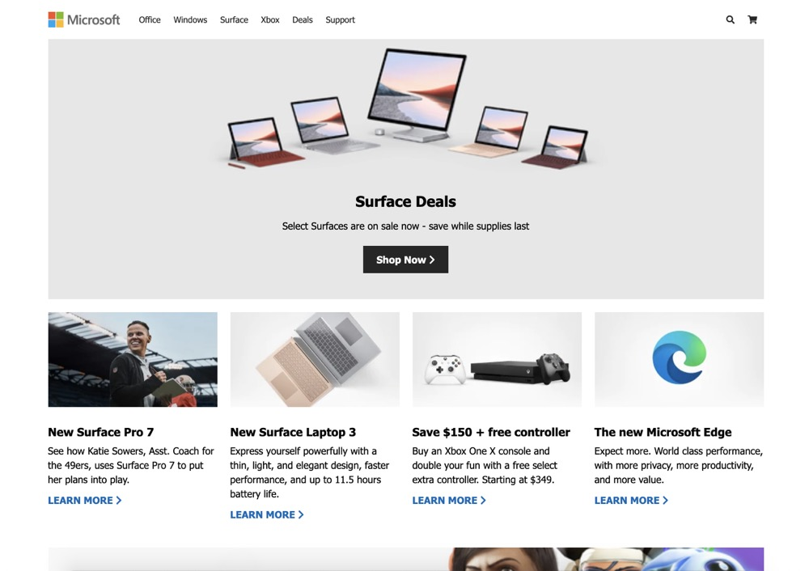
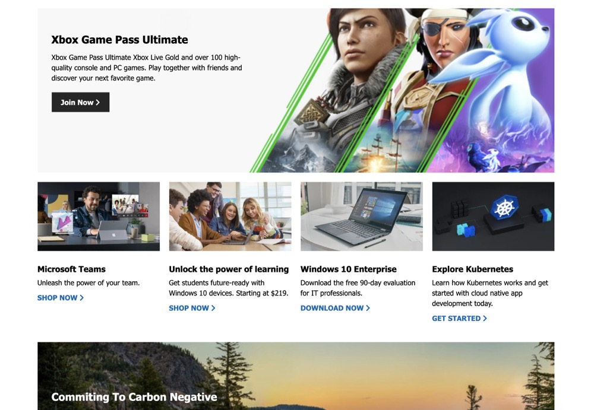
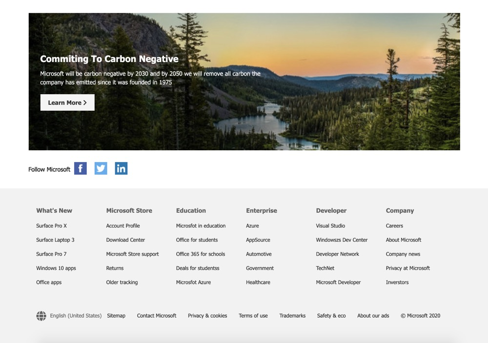

## Pure HTML CSS to implement Microsoft website home page

- flexbox
  - justify-content
  - align-item
- grid
  - grid-template-columns: repeat(n, 1fr)
  - grid-gap: 20px
- 屏幕宽度小于某个宽度时，导航栏连接隐藏，右侧出现面包栏，点击，左侧弹出导航栏
- media query
  - @media(max-width: 700px) // 屏幕宽度小于 700px 时触发

## Preview

## Codepan Reference Link

https://codepen.io/bradtraversy/details/ZEGGNRb
